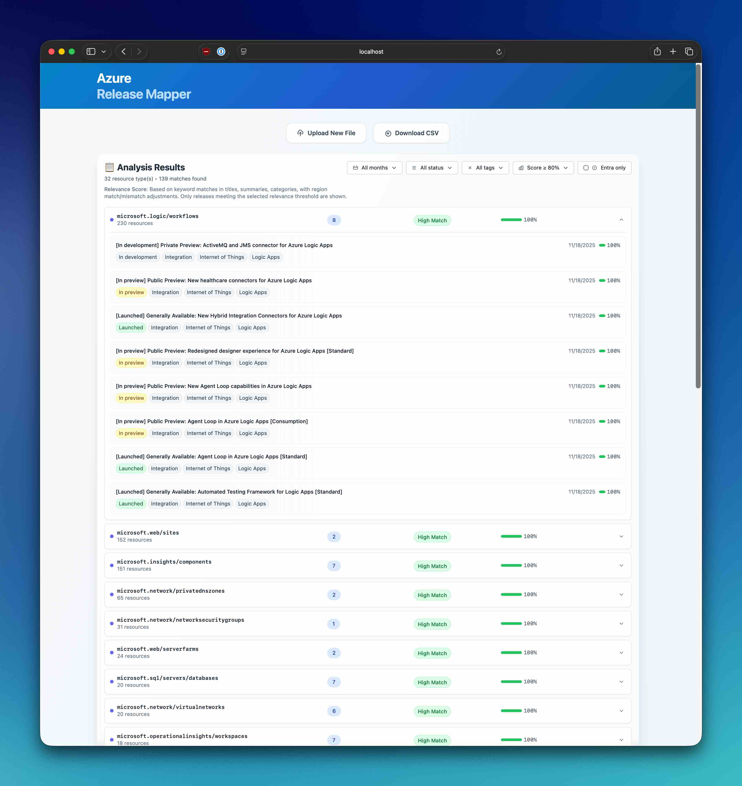

# Azure Release Mapper

Match Azure release announcements to your infrastructure. Upload a CSV export of your Azure resources and discover which updates are relevant to your deployed services.



## How It Works

1. Export "All resources" from Azure Portal as CSV (include the 'Resource Type' column)
2. Upload the CSV to the app
3. View matched Azure updates sorted by relevance score
4. Export results as CSV for tracking

The app uses heuristic scoring to match releases based on resource types, regions, and lifecycle keywords (GA, preview, breaking changes, etc.).

## Quick Start

```bash
# Frontend (port 5173)
cd frontend && npm install && npm run dev

# Backend (port 8787)
cd server && npm install && npm run dev
```

## Docker

```bash
docker build -t azure-release-mapper .
docker run -p 8787:8787 azure-release-mapper
```

## Tech Stack

- **Frontend**: React, TypeScript, Vite, Tailwind CSS
- **Backend**: Node.js, Express, TypeScript
- **Deployment**: Docker

## License

MIT
